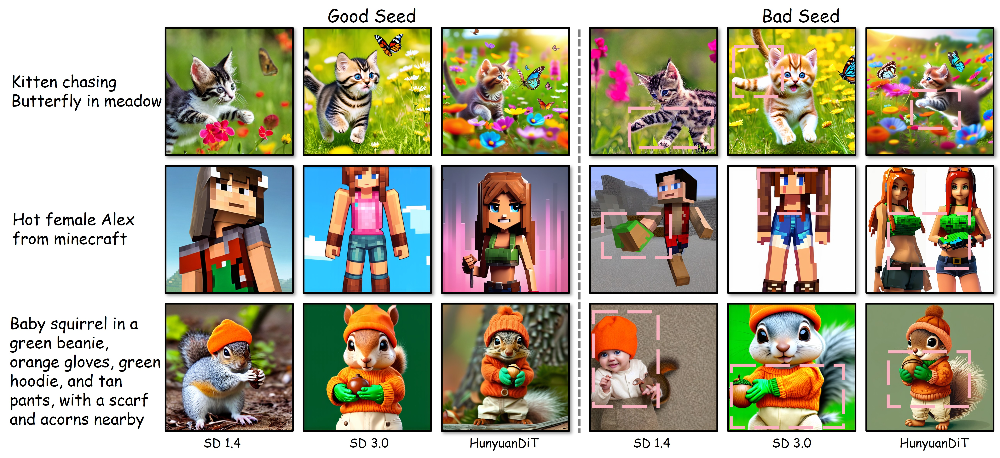

# Attention-Based Seed Selection (ABSS)

[](https://arxiv.org/abs/2605.19532)

## News 🚀️

Our paper ***ABSS*** has been accepted by NeurIPS 2026. 🎉🌸🎉



## Abstract

Text-to-image diffusion models can synthesize high-quality images, yet the outcome is notoriously sensitive to the random seed: different initial seeds often yield large variations in image quality and prompt–image alignment. We revisit this “seed effect” and show that attention dynamics over prompt core tokens, the content-bearing words, measured during the first few denoising steps, strongly predict final generation quality. Building on this observation, we introduce **Attention-Based Seed Selection (ABSS)**, a training-free, plug-and-play method that ranks seeds for a given prompt by leveraging cross-attention to core tokens during the denoising process. ABSS requires no finetuning and does not alter the initial noise; it scores and ranks all candidate seeds, keeps only the top-k for full generation, and discards the rest, without relying on a fixed accept/reject threshold. Operating purely at inference time, ABSS can serve as a lightweight pre-selection add-on for existing seed-optimization pipelines, enabling additional gains. Across three benchmarks, extensive experiments show that ABSS enables consistent improvements in text–image alignment and visual quality for Stable Diffusion variants, as corroborated by human preference and alignment metrics.

## Installation

Download the [FLUX.1-dev](https://huggingface.co/black-forest-labs/FLUX.1-dev) or [HunyuanDiT v1.2](https://huggingface.co/Tencent-Hunyuan/HunyuanDiT-v1.2-Diffusers) Diffusers checkpoint before running.

```bash
git clone https://github.com/Cool-Rayyyy1/ABSS.git
cd ABSS
conda create -n abss python=3.10 -y
conda activate abss
pip install torch==2.2.2 torchvision==0.17.2 --index-url https://download.pytorch.org/whl/cu118
pip install -r requirements.txt
```

## Usage👀️

```bash
python run.py --model flux --model-path /path/to/FLUX.1-dev
python run.py --model hunyuan --model-path /path/to/HunyuanDiT-v1.2-Diffusers
```

Both commands use **INITNO prompts 101–276**, generating **3 ABSS images and 3 random images** per prompt. ABSS ranks 10 candidate seeds at denoising **index 10 (zero-based)**, after the **11th** model forward. The selected top 3 resume from their saved latents and scheduler states for the remaining **39 of 50 steps**.

| Argument | Default |
| --- | --- |
| `--dataset` | `initno` |
| `--start-idx`, `--end-idx` | `101`, `276` |
| `--seed-pool-size` | `10` |
| `--top-k` | `3` |
| `--screening-steps` | `10` (zero-based index) |
| `--num-inference-steps` | `50` |
| `--guidance-scale` | `7.5` |
| `--base-seed` | `11` |

Use `--start-idx 101 --end-idx 101` for one prompt or `--no-random-baseline` for ABSS only. Prompts and core-token annotations are in [datasets/](datasets/); supply your own with `--prompts` and `--core-tokens`.

### Output🎉️

Images and manifests are saved under `runs/<model>/initno/test_11/`:

```text
abss/prompt_101/img_seed*.png
random/prompt_101/img_seed*.png
metadata/prompt_101/
manifest.csv
manifest.jsonl
```

Use `--output` to choose another run directory. Default image sizes are 512×512 for FLUX and 1024×1024 for HunyuanDiT.

## Evaluation

Install the evaluation dependencies in a separate environment:

```bash
conda create -n abss-eval python=3.10 -y
conda activate abss-eval
pip install -r evaluation/requirements.txt
```

Download the following files into a local directory such as `/path/to/evaluation`. Model directories should contain their Hugging Face config, weights, and tokenizer/processor files.

| Local path | Download |
| --- | --- |
| `hps/HPS_v2.1_compressed.pt` | [HPS v2.1](https://huggingface.co/xswu/HPSv2) |
| `clip/` | [CLIP ViT-L/14](https://huggingface.co/openai/clip-vit-large-patch14) |
| `pickscore/` | [PickScore](https://huggingface.co/yuvalkirstain/PickScore_v1) |
| `laion/` | [ViT-H/14](https://huggingface.co/laion/CLIP-ViT-H-14-laion2B-s32B-b79K), including `open_clip_pytorch_model.bin` and processor files |
| `imagereward/ImageReward.pt`, `imagereward/med_config.json` | [ImageReward](https://huggingface.co/THUDM/ImageReward) |
| `bert/` | [BERT tokenizer](https://huggingface.co/google-bert/bert-base-uncased) |

Score all ABSS and random images from a completed run:

```bash
weights=/path/to/evaluation
manifest=runs/flux/initno/test_11/manifest.csv
out=runs/evaluation/flux
for metric in hps clip imagereward pickscore; do
  python evaluation/score.py --manifest "$manifest" --metric "$metric" \
    --hps-checkpoint "$weights/hps/HPS_v2.1_compressed.pt" \
    --hps-backbone "$weights/laion/open_clip_pytorch_model.bin" \
    --clip-model "$weights/clip" \
    --pickscore-model "$weights/pickscore" --pickscore-processor "$weights/laion" \
    --imagereward-checkpoint "$weights/imagereward/ImageReward.pt" \
    --imagereward-config "$weights/imagereward/med_config.json" \
    --bert-tokenizer "$weights/bert" --output "$out/metrics/$metric"
done
python evaluation/aggregate.py --manifest "$manifest" \
  --scores "$out/metrics" --output "$out/summary"
```

For HunyuanDiT, set `manifest=runs/hunyuan/initno/test_11/manifest.csv` and `out=runs/evaluation/hunyuan`. Results include per-image scores, per-prompt means, and `summary/summary.csv` comparing ABSS with random. All evaluation weights load locally.

## Acknowledgements

Built on [Attention Map Diffusers](https://github.com/wooyeolBaek/attention-map-diffusers), [Diffusers](https://github.com/huggingface/diffusers), [FLUX](https://github.com/black-forest-labs/flux), and [HunyuanDiT](https://github.com/Tencent-Hunyuan/HunyuanDiT), with prompts from [InitNO](https://github.com/xiefan-guo/initno). See [LICENSE](LICENSE).
